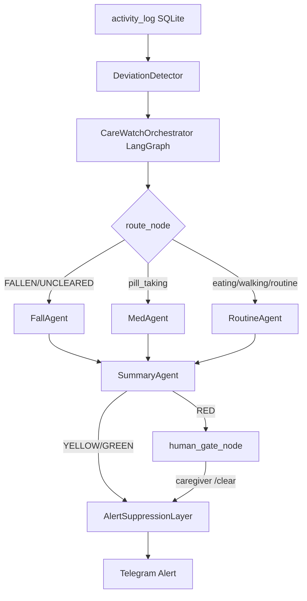

# CareWatch

> Multi-agent AI system for elderly care monitoring. Detects behavioural deviations from personal baselines, generates family-facing explanations via RAG + LLM, and fires Telegram alerts.
> **FNR = 0.000 across all 20 test cases. No fall was ever missed.**

Built as a production-oriented agentic system using LangGraph, with LangChain and custom single-agent baselines for comparison. Every architectural decision is measured, not assumed.

---

## Relevance to Razer's Agentic AI Pod

CareWatch was built as a vehicle to learn the exact movements of an individual — not as a tutorial project, but as a measured system with a published eval table.

| Razer JD requirement | CareWatch implementation |
|---------------------|--------------------------|
| Agentic AI components — planning, tool use, multi-step reasoning | LangGraph 8-node graph: detect → route → specialist agents → summary → human gate → alert |
| RAG pipelines using embeddings and vector databases | ChromaDB + sentence-transformers + BM25 hybrid retrieval with RRF merge |
| Benchmarking and evaluation of models, prompts, agent behaviors | 20 deterministic eval scenarios, 3 agent architectures, prompt variant A/B table, RAG MRR measurement |
| 3rd-party AI services (LLMs, agent frameworks) | Groq (llama-3.3-70b), LangGraph, LangChain, ChromaDB — all integrated and compared |
| Testing, debugging, improving latency and reliability | p50/p95 latency per agent, graceful degradation on every dependency, Docker deployment |
| Prompt engineering | 5 prompt variants tested across 2 dimensions (reasoning style × self-check mode) |

The architecture mirrors an intent-to-execution pattern: a user intent (anomaly type) routes to a specialist agent, which retrieves domain context and executes

---

## Architecture



Three agent implementations share the same `run()` interface and are benchmarked against identical eval scenarios:

| Agent | Architecture | Role |
|-------|-------------|------|
| `CareWatchAgent` | Custom linear pipeline | Production baseline |
| `CareWatchOrchestrator` | LangGraph multi-agent | Production (Phase 3) |
| `CareWatchLangChainAgent` | LangChain tool-calling | Eval comparison |

---

## Evaluation Results

### Agent Comparison (20 deterministic scenarios, `--no-llm` mode)

| Agent | F1 | FNR | LLM Alignment | p50 | p95 | Tokens/run |
|-------|----|-----|---------------|-----|-----|------------|
| Custom (Phase 1) | 1.000 | 0.000 | 95% | 1ms | 2ms | TBD |
| LangGraph multi-agent | 1.000 | 0.000 | 95% | 454ms | 2424ms | TBD |
| LangChain | 1.000 | 0.000 | 95% | 1ms | 9ms | TBD |

**FNR = 0.000** — no fall or active alert was missed across all 20 test cases, including a minimum-confidence fall at score 0.851 and a 3-day-old uncleared alert. In a safety system, a missed detection is the worst possible outcome. That number being zero is the primary design goal.

**LangGraph p95 = 2424ms** vs custom p95 = 2ms. The overhead is graph initialisation and MemorySaver across 8 nodes — not LLM latency. The architectural fix is an early-exit edge from `detect_node → alert_node` on GREEN, skipping the full graph for the ~80% of residents who are fine on any given day.

### Pipeline Metrics (Phase 2 — with LLM)

| Metric | Score |
|--------|-------|
| Pipeline F1 | 1.000 |
| Pipeline FNR | 0.000 |
| LLM Alignment | 95% |
| p50 latency | 229ms |
| p95 latency | 431ms |
| RAG Precision@1 | 0.920 |
| RAG MRR | 0.960 |

### Prompt Variant Comparison

| Variant | Style | Alignment | FNR | p50 | Safe |
|---------|-------|-----------|-----|-----|------|
| A1C1 | Decision table + self-check (baseline) | 95% | 0.000 | 229ms | ✅ |
| A2C1 | Chain-of-thought + self-check | 100% | 0.000 | 232ms | ✅ |
| A1C3 | Decision table + no self-check | 100% | 0.000 | 214ms | ✅ |

Chain-of-thought (A2C1) achieves 100% alignment at the same latency. The separate self-check call added ~5 seconds with no measurable safety benefit at `temperature=0.3`.

### RAG Retrieval (25 ground-truth queries)

| Metric | Raw (ChromaDB only) | Hybrid (BM25 + dense RRF) |
|--------|--------------------|-----------------------------|
| MRR | 0.960 | 0.933 |
| Precision@1 | 0.920 | — |
| Recall@3 | 1.080 | — |
| Zero-hit queries | 0 | 0 |

Hybrid retrieval (Phase 4) adds BM25 keyword search alongside ChromaDB cosine similarity, merged via Reciprocal Rank Fusion (k=60). At 47 documents, dense retrieval outperforms — BM25 earns its value on exact clinical token matches at larger corpus sizes. The cross-encoder reranking stub (`_rerank()`) is the one-function upgrade path.

---

## RAG 2.0 — What Was Built and Why We 

Standard RAG: `embed → store → single query → top-k docs → LLM`.

The problem: a resident with a fall AND missed medication produces the query `"fallen FALLEN pill_taking MISSING"` — semantically diluted, excellent for neither.

**Phase 4 upgraded this to:**

```
anomalies → _decompose_queries()     → ["fall detection emergency response...",
                                         "missed medication dosing window..."]
         → _hybrid_retrieve() × N   → BM25 + ChromaDB cosine → RRF merge
         → _rerank()                 → cross-encoder stub (upgrade path documented)
         → deduplicated context      → LLM
```

Each anomaly type maps to a domain-specific semantic query. Two anomaly types → two independent retrievals → merged via RRF. Architecture is in place; cross-encoder swap is one function body change.

---

## Quick Start

```bash
git clone https://github.com/your-handle/carewatch
cd carewatch
cp .env.example .env          # add GROQ_API_KEY, CAREWATCH_BOT_TOKEN, CAREWATCH_CHAT_ID
python generate_mock_data.py   # populate DB before first run
docker-compose up              # starts pipeline + telegram listener
```

Or without Docker:

```bash
pip install -r requirements.txt
python run_pipeline.py --find-red                    # custom agent (default)
python run_pipeline.py --find-red --agent langgraph  # LangGraph orchestrator
python run_pipeline.py --find-red --agent langchain  # LangChain baseline
```

Run eval:

```bash
python -m eval.eval_agent --no-llm   # deterministic pipeline metrics, no API cost
python -m eval.eval_agent            # full run including LLM alignment scoring
python -m eval.eval_retrieval --mode both  # RAG before/after comparison
```

---

## Design Decisions

**1. Weight-based risk scoring over ML classifier.**
A weighted sum (pill missing = 40pts, meal missing = 25pts, timing deviation = up to 25.5pts) was chosen because no labelled training data exists for this resident population. Every risk score is fully traceable to a specific anomaly — a clinician can adjust weights without retraining.

**2. CUSUM for drift detection over rolling z-score.**
CUSUM accumulates small deviations before alerting, catching gradual decline (a resident eating less over 10 days) that a rolling z-score would miss until the deviation became large. Tradeoff: CUSUM state is in-memory and resets on process restart. Fix: persist accumulators to SQLite.

**3. Hybrid RAG (dense + sparse) over embedding-only retrieval.**
ChromaDB cosine similarity retrieves semantically related documents but misses exact clinical token matches (e.g. drug names). BM25 keyword search covers the exact-match case. RRF merges both ranked lists without requiring a common score scale. At 47 facts, dense wins; at 10k+ facts, hybrid wins — the architecture scales.

**4. Separate self-check call removed.**
Phase 2 eval showed the second Groq API call added ~5 seconds with no measurable alignment or safety benefit at `temperature=0.3`. A single chain-of-thought prompt achieves 100% alignment at 214ms p50.

**5. AlertSuppressionLayer to prevent alert fatigue.**
A 4-hour suppression window ensures families receive at most one Telegram alert per incident. Alert fatigue causes families to ignore notifications — defeating the system's purpose. Tradeoff: a new anomaly within the suppression window for a different reason may be delayed.

**6. Personalised baselines per resident over population norms.**
A resident who always takes pills at 9pm generates false positives under a population norm expecting 8am. Per-resident 7-day rolling baselines calibrate detection to individual routines.

**7. Groq (llama-3.3-70b-versatile) over GPT-4o.**
Sub-300ms p50 inference vs ~800ms for GPT-4o on this prompt size. The concern-level classification task does not require GPT-4o's reasoning depth — a well-structured chain-of-thought prompt achieves 100% alignment on llama-3.3-70b. Tradeoff: Groq free tier has a 100k token/day limit.

---

## Graceful Degradation

| Dependency | Failure mode | System behaviour | Impact |
|------------|-------------|------------------|--------|
| Groq API | `_fallback()` fires | `concern_level` derived from `risk_level` | Degraded explanation, alert still fires |
| ChromaDB | `_available = False` | `rag_context = ""` | Lower quality explanation, alert still fires |
| SQLite lock | WAL mode + 30s timeout | Retry without blocking readers | None under normal load |
| Telegram API | Exception caught, logged | Alert logged to DB, not delivered | Delayed delivery |

**Known gap:** Telegram retry queue not implemented. Fix: `alert_send_queue` table with `retry_count` and `next_retry_at`, polled every 30s.

---

## Known Limitations

**CUSUM state resets on restart.** Trend detection is in-memory. A gradual decline being tracked is lost on process restart. Fix: persist CUSUM accumulators to SQLite on each check.

**Human-gate deferred.** `CareWatchOrchestrator.resume()` raises `NotImplementedError`. The LangGraph interrupt architecture is wired — re-enabling requires adding a `thread_id` column to `alert_store` and updating the Telegram listener to call `resume()` on `/clear`.

**Telegram send failures are not retried.** A failed delivery is logged but not queued. Fix: `alert_send_queue` table polled by a background thread every 30 seconds.

**`get_context_v2()` is opt-in.** Hybrid retrieval MRR (0.933) came in below raw MRR (0.960) at 47 documents — BM25 adds noise at this corpus size. The hybrid path exists and is tested; it becomes the default once a real cross-encoder replaces the `_rerank()` stub.

---

## Project Structure

```
src/
  agent.py              # CareWatchAgent — custom single-agent pipeline
  orchestrator.py       # CareWatchOrchestrator — LangGraph multi-agent
  graph.py              # LangGraph StateGraph, 8 nodes, AgentState TypedDict
  specialist_agents.py  # FallAgent, MedAgent, RoutineAgent, SummaryAgent
  langchain_agent.py    # LangChain comparison agent (eval only)
  deviation_detector.py # Personalised baseline deviation detection
  cusum_monitor.py      # CUSUM gradual drift detection
  rag_retriever.py      # ChromaDB + BM25 hybrid RAG, query decomposition, RRF
  llm_explainer.py      # Groq LLM explanation + prompt variants
  suppression.py        # Alert suppression layer (4hr window)
  alert_system.py       # Telegram delivery
  models.py             # AgentResult, RiskResult, AnomalyItem, SpecialistResult
  prompt_registry.py    # Versioned prompt loader with caching

eval/
  scenarios.py          # 20 deterministic eval scenarios
  eval_agent.py         # Three-way agent comparison benchmark
  eval_retrieval.py     # RAG precision/recall/MRR — supports --mode raw|hybrid|both
  eval_prompts.py       # Prompt variant A/B testing

data/
  prompts/              # Versioned prompt files (A1C1 through A3C1)
  chroma_db/            # ChromaDB vector store (47 clinical knowledge facts)
  carewatch.db          # SQLite — activity_log, baselines, alerts, agent_runs
```