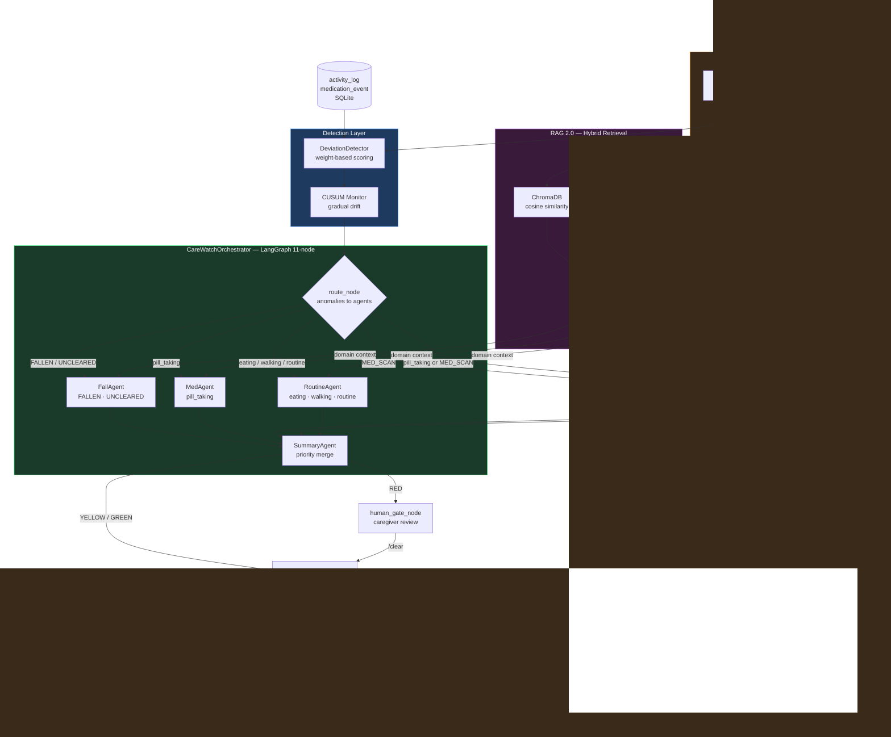

# CareWatch

Link to our Monitoring dashboard: https://carewatch-blue.vercel.app/dashboard.html

> Multi-agent AI system for elderly care monitoring. Detects behavioural deviations from personal baselines, generates family-facing explanations via RAG + LLM, fires Telegram alerts with optional TTS delivery, and enforces PDPA-aligned data privacy.
> **FNR = 0.000 across all 20 eval scenarios. No fall was ever missed.**

Built as a production-oriented agentic system using LangGraph. Every architectural decision is measured, not assumed.

---
---

## Architecture


Three agent implementations share the same `run()` interface and are benchmarked against identical eval scenarios:

| Agent | Architecture | Role |
|-------|-------------|------|
| `CareWatchAgent` | Custom linear pipeline | Production baseline |
| `CareWatchOrchestrator` | LangGraph multi-agent | Production (Phase 3+) |
| `CareWatchLangChainAgent` | LangChain tool-calling | Eval comparison |

---

## What's New 

Four capabilities that have now been added:

| Capability | Implementation | Entry point |
|---|---|---|
| CV medication label scanner | `src/label_detector.py` — mock path; swap `extract_from_image()` for Gemini/GPT-4o | `scan_node` in graph |
| Chronic illness inference | `src/chronic_detector.py` — local KB + Groq/SEA-LION fallback | `ChronicAgent` co-fires with `MedAgent` |
| TTS reminders | `src/tts.py` — pyttsx3, cross-platform | `voice_alert=True` on `graph.invoke()` |
| PDPA privacy layer | `src/privacy.py` — pseudonymous IDs, PII stripping, consent log, retention | `strip_pii()` before every Telegram send |

The graph grew from 8 nodes to 11. `scan_node` is now the entry point and is a no-op when `image_bytes` is absent — all existing runs are unaffected.

---

## Evaluation Results

### Agent Comparison (20 deterministic scenarios, `--no-llm` mode)

| Agent | F1 | FNR | LLM Alignment | p50 | p95 | Tokens/run |
|-------|----|-----|---------------|-----|-----|------------|
| Custom (Phase 1) | 1.000 | 0.000 | 95% | 1ms | 2ms | TBD |
| LangGraph multi-agent | 1.000 | 0.000 | 95% | 454ms | 2424ms | TBD |
| LangChain | 1.000 | 0.000 | 95% | 1ms | 9ms | TBD |

**FNR = 0.000** — no fall or active alert was missed across all 20 eval scenarios. In a safety system, a missed detection is the worst possible outcome.

**LangGraph p95 = 2424ms** vs custom p95 = 2ms. The overhead is graph initialisation and MemorySaver across 11 nodes — not LLM latency. The architectural fix is an early-exit edge from `detect_node → alert_node` on GREEN, skipping the full graph for the ~80% of residents who are fine on any given day.

### Integration Test Suite (8 scenarios, pytest)

| Test | What it proves |
|---|---|
| TC21 — scan_node no-op | `image_bytes=None` produces no scan_result, pipeline unchanged |
| TC22 — scan_node processes image | `image_bytes` → `scan_result` with medication_name, confidence, meal_relation |
| TC23 — scan writes DB | `medication_event` row written for scanned medication |
| TC24 — ChronicAgent T2DM | 10 Metformin events → "Type 2 Diabetes" in family alert summary |
| TC25 — insufficient history | 1 event → graceful "Insufficient history" without error |
| TC26 — low-confidence scan | confidence < 0.75 → `concern_level=watch`, manual verification requested |
| TC27 — PII stripped | Real names never appear in Telegram payload |
| TC28 — TTS fires | `voice_alert=True` → `speak()` called exactly once on YELLOW/RED |
```bash
python -m pytest tests/test_merge_integration.py -v
```

### Pipeline Metrics (Phase 2 — with LLM)

| Metric | Score |
|--------|-------|
| Pipeline F1 | 1.000 |
| Pipeline FNR | 0.000 |
| LLM Alignment | 95% |
| p50 latency | 229ms |
| p95 latency | 431ms |
| RAG Precision@1 | 0.920 |
| RAG MRR | 0.960 |

### Prompt Variant Comparison

| Variant | Style | Alignment | FNR | p50 | Safe |
|---------|-------|-----------|-----|-----|------|
| A1C1 | Decision table + self-check (baseline) | 95% | 0.000 | 229ms | ✅ |
| A2C1 | Chain-of-thought + self-check | 100% | 0.000 | 232ms | ✅ |
| A1C3 | Decision table + no self-check | 100% | 0.000 | 214ms | ✅ |

Chain-of-thought (A2C1) achieves 100% alignment at the same latency. The separate self-check call added ~5 seconds with no measurable safety benefit at `temperature=0.3`.

### RAG Retrieval (25 ground-truth queries)

| Metric | Raw (ChromaDB only) | Hybrid (BM25 + dense RRF) |
|--------|--------------------|-----------------------------|
| MRR | 0.960 | 0.933 |
| Precision@1 | 0.920 | — |
| Recall@3 | 1.080 | — |
| Zero-hit queries | 0 | 0 |

---

## RAG 2.0 — What Was Built and Why

Standard RAG: `embed → store → single query → top-k docs → LLM`.

The problem: a resident with a fall AND missed medication produces the query `"fallen FALLEN pill_taking MISSING"` — semantically diluted, excellent for neither.

**Phase 4 upgraded this to:**
```
anomalies → _decompose_queries()     → ["fall detection emergency response...",
                                         "missed medication dosing window..."]
         → _hybrid_retrieve() × N   → BM25 + ChromaDB cosine → RRF merge
         → _rerank()                 → cross-encoder stub (upgrade path documented)
         → deduplicated context      → LLM
```

Each anomaly type maps to a domain-specific semantic query. Two anomaly types → two independent retrievals → merged via RRF. Architecture is in place; cross-encoder swap is one function body change.

---

## Quick Start
```bash
git clone https://github.com/your-handle/carewatch
cd carewatch
cp .env.example .env          # add GROQ_API_KEY, CAREWATCH_BOT_TOKEN, CAREWATCH_CHAT_ID
python generate_mock_data.py   # populate DB before first run
docker-compose up              # starts pipeline + telegram listener
```

Or without Docker:
```bash
pip install -r requirements.txt
python run_pipeline.py --find-red                    # custom agent (default)
python run_pipeline.py --find-red --agent langgraph  # LangGraph orchestrator
python run_pipeline.py --find-red --agent langchain  # LangChain baseline
```

Run eval:
```bash
python -m eval.eval_agent --no-llm                 # deterministic pipeline metrics, no API cost
python -m eval.eval_agent                          # full run including LLM alignment scoring
python -m eval.eval_retrieval --mode both          # RAG before/after comparison
python -m pytest tests/test_merge_integration.py -v  # merge integration suite
```

Scan a medication label via API:
```bash
python app/api.py &
curl -X POST http://localhost:8000/residents/resident_001/scan \
  -F "file=@label_recognition/image1.png"
# Returns: {"medication_name": "Metformin", "dose": "500mg", "meal_relation": "after", "confidence": 0.94}
```

---

## Design Decisions

**1. Weight-based risk scoring over ML classifier.**
A weighted sum (pill missing = 40pts, meal missing = 25pts, timing deviation = up to 25.5pts) was chosen because no labelled training data exists for this resident population. Every risk score is fully traceable to a specific anomaly — a clinician can adjust weights without retraining.

**2. CUSUM for drift detection over rolling z-score.**
CUSUM accumulates small deviations before alerting, catching gradual decline (a resident eating less over 10 days) that a rolling z-score would miss until the deviation became large. Tradeoff: CUSUM state is in-memory and resets on process restart. Fix: persist accumulators to SQLite.

**3. Hybrid RAG (dense + sparse) over embedding-only retrieval.**
ChromaDB cosine similarity retrieves semantically related documents but misses exact clinical token matches (e.g. drug names). BM25 keyword search covers the exact-match case. RRF merges both ranked lists without requiring a common score scale. At 47 facts, dense wins; at 10k+ facts, hybrid wins — the architecture scales.

**4. Separate self-check call removed.**
Phase 2 eval showed the second Groq API call added ~5 seconds with no measurable alignment or safety benefit at `temperature=0.3`. A single chain-of-thought prompt achieves 100% alignment at 214ms p50.

**5. AlertSuppressionLayer to prevent alert fatigue.**
A 4-hour suppression window ensures families receive at most one Telegram alert per incident. Alert fatigue causes families to ignore notifications — defeating the system's purpose. Tradeoff: a new anomaly within the suppression window for a different reason may be delayed.

**6. Personalised baselines per resident over population norms.**
A resident who always takes pills at 9pm generates false positives under a population norm expecting 8am. Per-resident 7-day rolling baselines calibrate detection to individual routines.

**7. Groq (llama-3.3-70b-versatile) over GPT-4o.**
Sub-300ms p50 inference vs ~800ms for GPT-4o on this prompt size. The concern-level classification task does not require GPT-4o's reasoning depth — a well-structured chain-of-thought prompt achieves 100% alignment on llama-3.3-70b. Tradeoff: Groq free tier has a 100k token/day limit.

**8. scan_node as graph entry point, no-op when image absent.**
Making scan_node the entry point rather than a conditional branch means the graph structure is identical for all runs. When `image_bytes` is None, scan_node returns immediately and the pipeline is identical to pre-merge behaviour. A separate scan graph was rejected because it would duplicate the suppression and alert logic.

**9. ChronicAgent co-fires with MedAgent rather than opt-in routing.**
Medication history is always relevant when medication anomalies are detected. Opt-in routing would require callers to explicitly request chronic inference — easy to forget. ChronicAgent fires automatically whenever MedAgent fires and degrades gracefully when history is insufficient (< 2 events).

**10. PII stripped at alert boundary, not at storage.**
PDPA requires that personal data is protected in transmission, not necessarily at rest within a closed system. Stripping PII in `alert_system.py` before the Telegram send keeps the internal audit log queryable by person_id while ensuring no real names leave the system boundary. Consent is logged server-side (SQLite) rather than frontend-only because PDPA requires an auditable record.

---

## Graceful Degradation

| Dependency | Failure mode | System behaviour | Impact |
|------------|-------------|------------------|--------|
| Groq API | `_fallback()` fires | `concern_level` derived from `risk_level` | Degraded explanation, alert still fires |
| ChromaDB | `_available = False` | `rag_context = ""` | Lower quality explanation, alert still fires |
| SQLite lock | WAL mode + 30s timeout | Retry without blocking readers | None under normal load |
| Telegram API | Exception caught, logged | Alert logged to DB, not delivered | Delayed delivery |
| Vision API (scan) | `extract_from_image()` raises | `scan_result = None`, pipeline continues | Scan feature unavailable, detection unaffected |
| TTS engine | Exception caught, logged | Alert fires via Telegram only | No voice reminder |
| ChronicAgent DB read | Exception caught, `events = []` | "Insufficient history" returned | No chronic inference for this run |

**Known gap:** Telegram retry queue not implemented. Fix: `alert_send_queue` table with `retry_count` and `next_retry_at`, polled every 30s.

---

## Known Limitations

**CUSUM state resets on restart.** Trend detection is in-memory. A gradual decline being tracked is lost on process restart. Fix: persist CUSUM accumulators to SQLite on each check.

**Human-gate deferred.** `CareWatchOrchestrator.resume()` raises `NotImplementedError`. The LangGraph interrupt architecture is wired — re-enabling requires adding a `thread_id` column to `alert_store` and updating the Telegram listener to call `resume()` on `/clear`.

**Telegram send failures are not retried.** A failed delivery is logged but not queued. Fix: `alert_send_queue` table polled by a background thread every 30 seconds.

**Label scanner returns mock data.** `MedicationLabelDetector.extract_from_image()` returns a random realistic prescription. Production path: swap the function body to call Gemini Vision or GPT-4o. The interface is unchanged.

**ChronicAgent LLM fallback requires API key.** When a medication is not in the local knowledge base, `ChronicDetector.infer_from_name()` falls back to Groq then SEA-LION. `SEA_LION_API_KEY` is not yet in `.env.example`.

**`get_context_v2()` is opt-in.** Hybrid retrieval MRR (0.933) came in below raw MRR (0.960) at 47 documents — BM25 adds noise at this corpus size. The hybrid path exists and is tested; it becomes the default once a real cross-encoder replaces the `_rerank()` stub.

---

## Project Structure
```
src/
  agent.py              # CareWatchAgent — custom single-agent pipeline
  orchestrator.py       # CareWatchOrchestrator — LangGraph multi-agent
  graph.py              # LangGraph StateGraph, 11 nodes, AgentState TypedDict
  specialist_agents.py  # FallAgent, MedAgent, RoutineAgent, ChronicAgent, MedScanAgent, SummaryAgent
  label_detector.py     # CV medication label scanner (mock → swap for vision API)
  chronic_detector.py   # Chronic illness inference from medication history
  privacy.py            # PDPA: pseudonymous IDs, PII stripping, consent log, retention
  tts.py                # TTS reminder delivery (pyttsx3)
  medication.py         # MedicationRepo — schedules, events, reminders
  medication_ai.py      # MedicationAI — illness inference helpers
  langchain_agent.py    # LangChain comparison agent (eval only)
  deviation_detector.py # Personalised baseline deviation detection
  cusum_monitor.py      # CUSUM gradual drift detection
  rag_retriever.py      # ChromaDB + BM25 hybrid RAG, query decomposition, RRF
  llm_explainer.py      # Groq LLM explanation + prompt variants
  suppression.py        # Alert suppression layer (4hr window)
  alert_system.py       # Telegram delivery + TTS trigger + PII stripping
  models.py             # AgentResult, RiskResult, AnomalyItem, SpecialistResult
  prompt_registry.py    # Versioned prompt loader with caching

app/
  api.py                # FastAPI — pipeline trigger, scan upload, medication CRUD, consent
  realtime_inference.py # Background monitoring loop + meal reminder loop

eval/
  scenarios.py          # 20 deterministic eval scenarios
  eval_agent.py         # Three-way agent comparison benchmark
  eval_retrieval.py     # RAG precision/recall/MRR — supports --mode raw|hybrid|both
  eval_prompts.py       # Prompt variant A/B testing

tests/
  test_merge_integration.py  # 8 pytest integration tests (TC21–28) — graph.invoke with isolated DB

data/
  prompts/              # Versioned prompt files (A1C1 through A3C1)
  chroma_db/            # ChromaDB vector store (47 clinical knowledge facts)
  carewatch.db          # SQLite — activity_log, baselines, alerts, agent_runs, medication_event
  medications_db.json   # Local chronic illness knowledge base (auto-extended by LLM fallback)

label_recognition/      # Sample pill bottle images for scan testing
model/                  # Trained CV model files (MobileNet, YOLO weights)
scripts/
  infer_chronic_illness.py        # Standalone CLI: infer conditions from medication name
  infer_image.py                  # Standalone CLI: scan pill bottle image
  prescription_to_illness_pipeline.py  # End-to-end prescription → illness report
```
