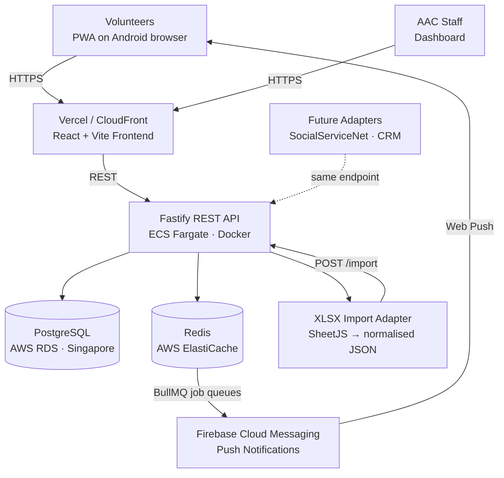
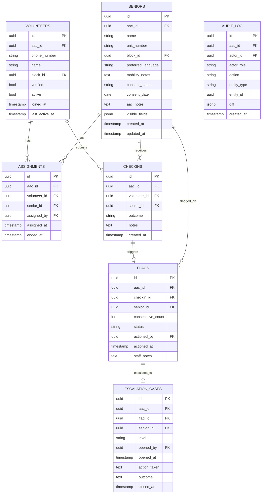
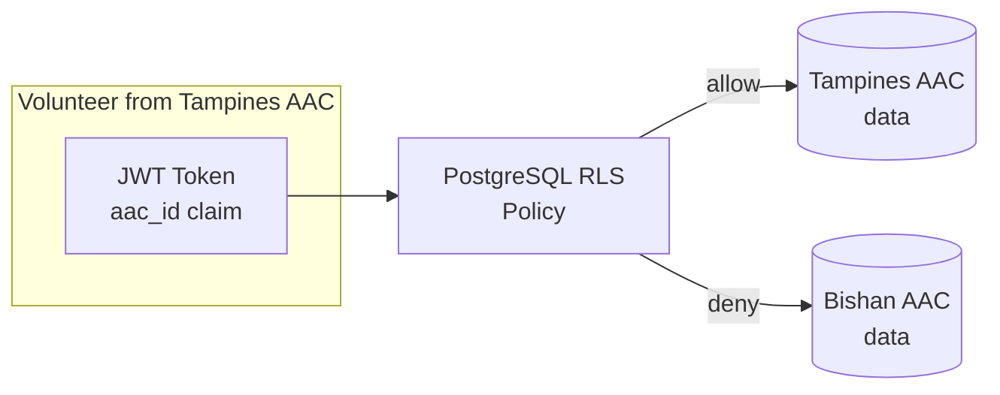
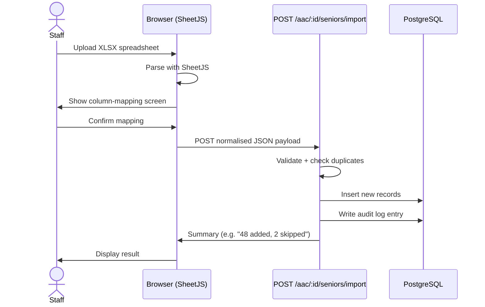
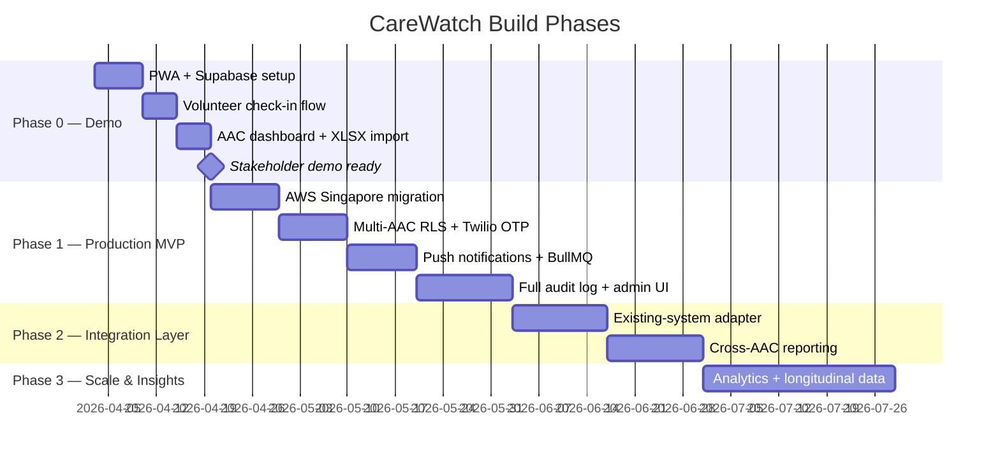

# CareWatch

A multi-tenant community eldercare check-in platform built for Active Ageing Centres (AACs) in Singapore. Volunteers conduct daily wellness check-ins on assigned seniors; AAC staff monitor coverage, review flags, and manage escalations — all from a single system.

---

## Table of Contents

- [Overview](#overview)
- [Architecture](#architecture)
- [Tech Stack](#tech-stack)
- [Data Model](#data-model)
- [API Reference](#api-reference)
- [Multi-Tenancy](#multi-tenancy)
- [Import System](#import-system)
- [Build Phases](#build-phases)
- [Portability](#portability)

---

## Overview

CareWatch connects volunteers to seniors living alone in HDB blocks. Each volunteer is assigned a small group of seniors and performs daily check-ins via a Progressive Web App (PWA) — no app store, no installation required. AAC staff see real-time dashboards, open flag queues, and can escalate cases when a senior is unreachable.

The system is designed for:
- **Low-end Android devices** — PWA avoids storage and compatibility constraints
- **Multi-tenancy from day one** — 20+ AACs, each fully isolated at the database level
- **Zero vendor lock-in** — Docker + Prisma + Terraform, deployable on any cloud

---

## Architecture

```mermaid
graph TD
    V[Volunteers\nPWA on Android browser]
    S[AAC Staff\nDashboard]
    CF[Vercel / CloudFront\nReact + Vite Frontend]
    API[Fastify REST API\nECS Fargate · Docker]
    DB[(PostgreSQL\nAWS RDS · Singapore)]
    REDIS[(Redis\nAWS ElastiCache)]
    FCM[Firebase Cloud Messaging\nPush Notifications]
    XLSX[XLSX Import Adapter\nSheetJS → normalised JSON]
    FUTURE[Future Adapters\nSocialServiceNet · CRM]

    V -->|HTTPS| CF
    S -->|HTTPS| CF
    CF -->|REST| API
    API --> DB
    API --> REDIS
    REDIS -->|BullMQ job queues| FCM
    FCM -->|Web Push| V
    API --> XLSX
    XLSX -->|POST /import| API
    FUTURE -.->|same endpoint| API
```

---

## Tech Stack

### Demo (Zero Cost)

| Layer | Choice | Why |
|---|---|---|
| Volunteer interface | PWA (React + Vite) on Vercel | No app store, runs in any Android browser |
| AAC dashboard | Same React app, different route | One codebase, free tier |
| Backend + DB | Supabase free tier | PostgreSQL + auth + REST + RLS out of the box |
| Auth | Supabase Auth — email OTP | Twilio costs money; email OTP is free |
| XLSX import | SheetJS in-browser → POST to Supabase | Zero backend cost |
| Push notifications | Skipped for demo | Not needed to prove the concept |

### Production

| Layer | Choice | Why |
|---|---|---|
| Volunteer interface | PWA (React + Vite) | Old budget phones can't be assumed to have storage; PWA runs in browser, works on Android 8+ |
| AAC dashboard | React + Vite, separate deployment | Internal tool — fast to build and maintain |
| Backend | Node.js + Fastify | Lightweight, fast, strong ecosystem |
| Database | PostgreSQL on AWS RDS (ap-southeast-1) | Relational model suits assignments + check-ins + audit logs; PDPA compliance |
| Auth | JWT — volunteers via Twilio OTP, staff via email + password | Phone OTP reduces friction for less tech-savvy volunteers |
| XLSX import | SheetJS on frontend → normalised POST | Any staff can upload a spreadsheet without IT involvement |
| Push notifications | Firebase Cloud Messaging (Web Push) | Free generous tier; works on Android Chrome |
| Background jobs | BullMQ + Redis (ElastiCache) | Daily reminders, auto-escalation after 3 consecutive no-answers |
| Hosting | AWS ap-southeast-1 — ECS Fargate, RDS, S3 + CloudFront | Singapore region, no vendor lock-in |
| Portability | Docker + Prisma migrations + Terraform IaC | Full infrastructure as code; handover-ready |
| Monitoring | AWS CloudWatch + Sentry | Standard, cost-effective |

---

## Data Model

```mermaid
erDiagram
    SENIORS {
        uuid id PK
        uuid aac_id FK
        string name
        string unit_number
        uuid block_id FK
        string preferred_language
        text mobility_notes
        string consent_status
        date consent_date
        text aac_notes
        jsonb visible_fields
        timestamp created_at
        timestamp updated_at
    }

    VOLUNTEERS {
        uuid id PK
        uuid aac_id FK
        string phone_number
        string name
        uuid block_id FK
        bool verified
        bool active
        timestamp joined_at
        timestamp last_active_at
    }

    ASSIGNMENTS {
        uuid id PK
        uuid aac_id FK
        uuid volunteer_id FK
        uuid senior_id FK
        uuid assigned_by FK
        timestamp assigned_at
        timestamp ended_at
    }

    CHECKINS {
        uuid id PK
        uuid aac_id FK
        uuid volunteer_id FK
        uuid senior_id FK
        string outcome
        text notes
        timestamp created_at
    }

    FLAGS {
        uuid id PK
        uuid aac_id FK
        uuid checkin_id FK
        uuid senior_id FK
        int consecutive_count
        string status
        uuid actioned_by FK
        timestamp actioned_at
        text staff_notes
    }

    ESCALATION_CASES {
        uuid id PK
        uuid aac_id FK
        uuid flag_id FK
        uuid senior_id FK
        string level
        uuid opened_by FK
        timestamp opened_at
        text action_taken
        text outcome
        timestamp closed_at
    }

    AUDIT_LOG {
        uuid id PK
        uuid aac_id FK
        uuid actor_id FK
        string actor_role
        string action
        string entity_type
        uuid entity_id
        jsonb diff
        timestamp created_at
    }

    VOLUNTEERS ||--o{ ASSIGNMENTS : has
    SENIORS    ||--o{ ASSIGNMENTS : has
    VOLUNTEERS ||--o{ CHECKINS   : submits
    SENIORS    ||--o{ CHECKINS   : receives
    CHECKINS   ||--o| FLAGS      : triggers
    FLAGS      ||--o| ESCALATION_CASES : escalates_to
    SENIORS    ||--o{ FLAGS      : flagged_on
```

> Every table carries `aac_id`. PostgreSQL Row Level Security (RLS) ensures a volunteer from Tampines AAC can never see a senior from Bishan AAC — the database refuses to return the row, not just the application.

---

## API Reference

| Method | Endpoint | Role | Purpose |
|---|---|---|---|
| POST | `/auth/otp/request` | Public | Request OTP to phone |
| POST | `/auth/otp/verify` | Public | Verify OTP, return JWT |
| GET | `/me/seniors` | Volunteer | Assigned seniors only |
| GET | `/seniors/:id` | Volunteer / Staff | Profile (field-filtered by role) |
| POST | `/seniors/:id/checkins` | Volunteer | Submit check-in |
| POST | `/aac/:id/seniors/import` | Staff / Admin | Bulk import from XLSX |
| GET | `/dashboard/overview` | Staff | Stats across all blocks |
| GET | `/dashboard/flags` | Staff | Open flag queue |
| PATCH | `/flags/:id` | Staff | Update flag status |
| POST | `/escalations` | Staff | Open escalation case |
| GET | `/volunteers` | Staff | Volunteer list + activity |
| POST | `/assignments` | Admin | Assign volunteer to senior |
| PATCH | `/seniors/:id/visibility` | Admin | Control what volunteers see |
| PATCH | `/seniors/:id/consent` | Admin | Update consent status |
| GET | `/reports/coverage` | Super Admin | Cross-AAC coverage report |

---

## Multi-Tenancy

```mermaid
flowchart LR
    JWT[JWT Token\naac_id claim]
    RLS[PostgreSQL RLS\nPolicy]
    TAMPINES[(Tampines AAC\ndata)]
    BISHAN[(Bishan AAC\ndata)]

    JWT --> RLS
    RLS -->|allow| TAMPINES
    RLS -->|deny| BISHAN

    subgraph "Volunteer from Tampines AAC"
        JWT
    end
```

- Every core table has an `aac_id` column
- RLS policies enforce that queries only return rows matching the authenticated user's AAC
- Staff and Admin roles are scoped to their `aac_id` at the JWT level
- A **super-admin** role (for the central team) can query across all AACs for reporting

---

## Import System

```mermaid
sequenceDiagram
    actor Staff
    participant Browser as Browser (SheetJS)
    participant API as POST /aac/:id/seniors/import
    participant DB as PostgreSQL

    Staff->>Browser: Upload XLSX spreadsheet
    Browser->>Browser: Parse with SheetJS
    Browser->>Staff: Show column-mapping screen
    Staff->>Browser: Confirm mapping
    Browser->>API: POST normalised JSON payload
    API->>API: Validate + check duplicates
    API->>DB: Insert new records
    API->>DB: Write audit log entry
    API->>Browser: Summary (e.g. "48 added, 2 skipped")
    Browser->>Staff: Display result
```

The `POST /aac/:id/seniors/import` endpoint is intentionally generic. The XLSX UI is the first adapter — future connectors (SocialServiceNet, custom CRM) will call the same endpoint with normalised JSON, with no changes to the core system.

---

## Build Phases

```mermaid
gantt
    title CareWatch Build Phases
    dateFormat  YYYY-MM-DD
    section Phase 0 — Demo
    PWA + Supabase setup        :p0a, 2026-04-03, 7d
    Volunteer check-in flow     :p0b, after p0a, 5d
    AAC dashboard + XLSX import :p0c, after p0b, 5d
    Stakeholder demo ready      :milestone, after p0c, 0d

    section Phase 1 — Production MVP
    AWS Singapore migration     :p1a, after p0c, 10d
    Multi-AAC RLS + Twilio OTP  :p1b, after p1a, 10d
    Push notifications + BullMQ :p1c, after p1b, 10d
    Full audit log + admin UI   :p1d, after p1c, 14d

    section Phase 2 — Integration Layer
    Existing-system adapter     :p2a, after p1d, 14d
    Cross-AAC reporting         :p2b, after p2a, 14d

    section Phase 3 — Scale & Insights
    Analytics + longitudinal data :p3a, after p2b, 28d
```

| Phase | Scope | Timeline |
|---|---|---|
| **0 — Demo** | PWA + Supabase, check-in flow, dashboard, XLSX import, flagging. Zero cost. | 2–3 weeks |
| **1 — Production MVP** | AWS Singapore, multi-AAC RLS, Twilio OTP, FCM push, BullMQ jobs, audit log | 6–8 weeks after Phase 0 |
| **2 — Integration Layer** | Existing-system adapters (SocialServiceNet, CRM), cross-AAC reporting | 4 weeks after Phase 1 stable |
| **3 — Scale & Insights** | Volunteer fatigue analytics, escalation outcome tracking, SingPass/Corppass integration | Ongoing |

---

## Portability

The system is fully portable by design:

- **Docker** — every service is containerised; no server config required
- **Prisma migrations** — full schema history with rollback capability
- **Terraform IaC** — entire AWS infrastructure defined as code
- **No proprietary lock-in** — all services (RDS, ElastiCache, ECS, CloudFront) have direct equivalents on GCP or Azure

Hand over the repo and the Terraform state file, and any vendor can redeploy the entire system from scratch on any cloud.

---

*Built for Singapore's community care network. Designed to scale from one AAC pilot to the national level.*
